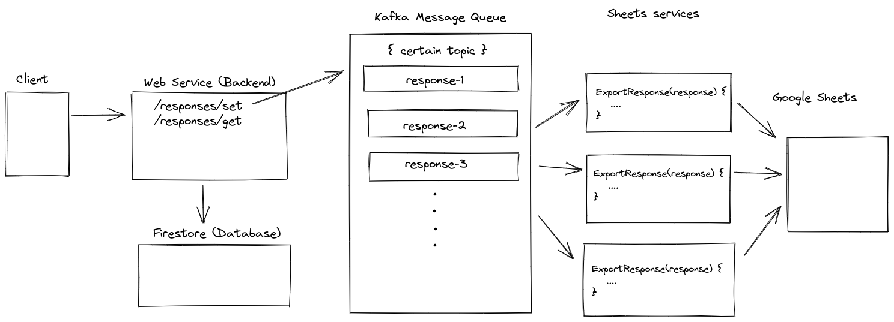
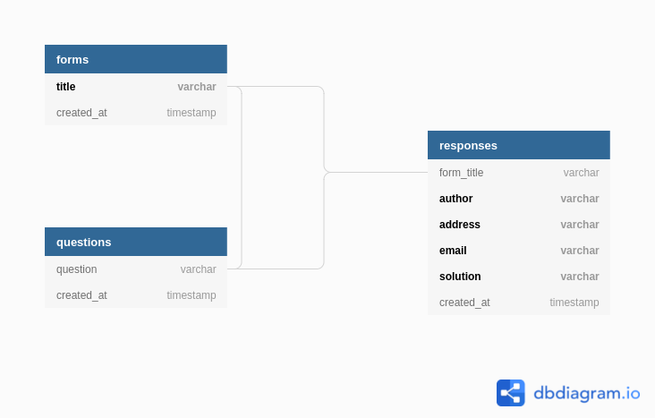

# Atlan Challenge : Google Sheets Plugin

A simple web service which shows the implementation of a data collection and exporting feature using Go and Kafka with a Pub/Sub Architechture. The application was designed to show a demo of how a **failsafe**, **highly-available**, **pluggable interface** can be created to complement the backend of a large infrastructure.

## Overview

This project can be divided into three major steps:
- A simple web service application to receive responses that adhere to a certain format.
- Implementation of the database to manage storage of responses as a long term solution
- Implementation of a Pub/Sub Architechture using Kafka as a event streaming interface.

## Architechture



## Core API and Concepts

At its core, this application is just a web service which accepts responses in the form of JSON and then stores it in a database and also exports it to Google Sheets as a post-business logic.

The Google Sheets service is built to be loosely coupled with the web service and a highly-available and fault tolerant architecture can be created with the help of some Event-Subcription model, here implemented with the help of Kafka.

We can also run multiple sheets instances so that failure of one doesn't hinder the functionality of our application.

## Communicating changes to subscribers

Kafka runs a message queue which receives created responses as message values. When the Google Sheets Service is online, it consumes all of the messages in the message queue and makes appropriate requests to the API server to append responses to the sheet.

## Database Schema

Over-engineering the Database can lead to increases complexity and make it harder for the project to maintain. Therefore I implemented the database in this project using Firestore. It is easy to implement and can prove to be cost effective in long term.

If we were to implement it using a SQL database then the database schema design would be like:



Form -> Responses (One to Many)
Form -> Questions (One to Many)
Questions -> Responses (One to Many)

## Running

You will need to create a Firebase Application to make a datastore for storing all the data. You will also need to enable the Sheets API and have a ```serviceAccountKey.json``` file (downloaded from GCP console) in the project repository for the Sheets API to function properly.

The application requires Docker and docker-compose to run locally.

```sh
# Start the Kafka Containers
docker-compose up -d 
```

Once the server is up and running we can make GET, POST requests for responses to the server.

```sh
# GET request to fetch all the responses
curl --request GET --url 'http://localhost:5000/responses/get'

# POST request to create a response
curl --request POST \
          --url 'http://localhost:5000/responses/set' \
          --header 'content-type: application/json' \
          --data '{
      "author": "some name","address":"some address","email":"some@corp.com","solution":"some solution"
    }'
```

## Monitoring, Tracing and Logs

We can implement OpenTelemetry instrumentation for our backend APIs and services. Then we will need to  configure a OpenTelemetry Collector for collecting necessary metrics, traces and logs, which can be exported to backends such as Prometheus (monitoring), Jaegar (Tracing) and Fluentd or Zap (Logging) . This can also be scaled up if we use services such as Thanos for a highly available Prometheus setup, but the implementation of those are out of the scope of this project.

Few of default/custom metrics which can be helpful in our instrumentation:
- Latency or response time.
- Traffic or connections.
- Errors.
- Saturation.
- Avaibility of Services and Database (Healthchecks)
- No. of messages which were not sent by Kafka
- No. of messages which were sent but not received

Prometheus effectively uses an Alertmanager which we can use to diagonise system health and errors on custom rules.

## Limitations

There are some limitations on the usage of Sheets API, which can hinder the performance of the Google Sheets plugin.

- Rate limit for requests on Google Sheets API is 300 write requests per minute per project and 60 write requests per minute per user per project.
- Free Google Account only gives 15 GB of storage. So we are dependent on the storage provided by our Google Drive Plans.

## Problems Faced

- Currently if we restart our server, the Sheets Service reconsumes all the previous messages from the Kafka Message Queue, leading to duplicate messages in Google Sheets. This can be fixed by updating rows by matching them with a specific email address (considering only one response is allowed). But this will need us to iterate over an entire spreadsheet which can be time-consuming and also take multiple writes to Sheets. We can also clear the entire spreadsheet when we close our server instance, but that will also require multiple writes to the Google Sheets (which can be rate-limited).